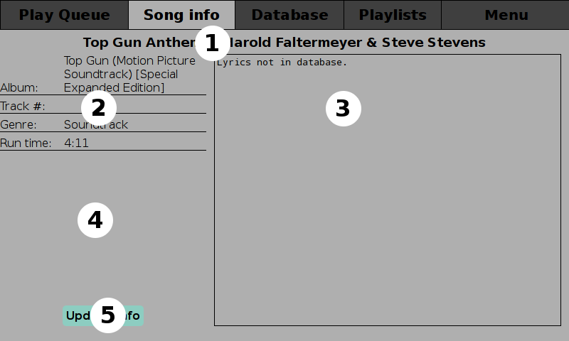
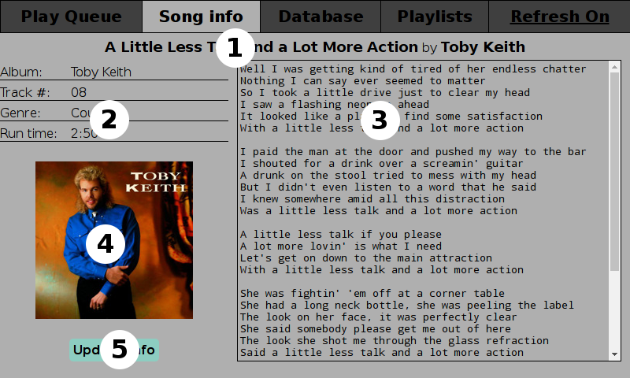

# Song Info Tab

  
The above screen shot shows the tab when there are no lyrics or coverart available.

  
This screen shot shows the tab with lyrics and coverart.

1. Audio track title and artist/band name.
2. Album/Compilation name, Track number, Genre, and Runtime.  
 Tap on the album name to list the audio files available for that album.
3. The lyrics or transcription of the audio track is displayed here if available.
4. Cover art for the album.
5. A button to manually check for updated info.
